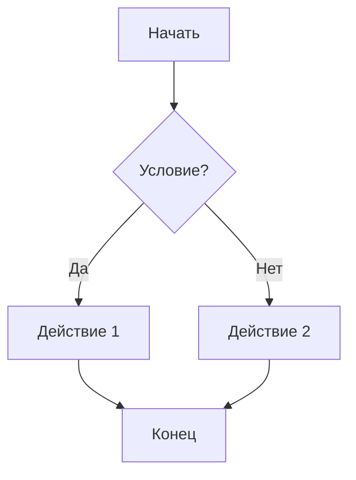

---
date:
  - 04/09/2024 10:38
tags: 
cssclasses:
  - image-borders
  - neutral-pen-black
---
# Классификация
Существует как минимум 3 вида:
- Тип коммутации
	- ![[Pasted image 20240904104313.png]]
	- Коммутация каналов. Перед передачей данных устанавливается соединение. Затем данные идут по установленному соединению (как при телефонных звонках).
	- Коммутация пакетов (используется в интернете). Данные делятся на пакеты, а затем идут по предустановленному пути.
		- Преимуществом данного варианта является отказоустойчивость. Если в первом варианте соединение с одним из коммутаторов оборвется, то данные поступать перестанут, во втором же случае данные начнут поступать на другой коммутатор.
		- При передаче данных на каждый коммутатор, решается задача маршрутизации: необходимость вычесления дальнейшего пути передачи данных. Данный ход создает дополнительную вычислительную нагрузку.
- Технологии передачи
	- ![[Pasted image 20240904104559.png]]
	- Широковещательные сети. В данном варианте данные, попавшие в сеть, становятся доступными всем участникам данной сети.
	- Точка-точка. Тут данные передаются от компьютера к компьютеру.
- Протяженность
	- ![[Pasted image 20240904104715.png]]
# Топология
- Топология сети - есть конфигурация графа:
	- **Вершины** — узлы сети (компьютеры)
	- **Ребра** — соединения между узлами
- Существует несколько базовых топологий
	- Полносвязная
		- ![[Pasted image 20240904111521.png]]
		- Каждое устройство связано со всеми другими
		- **Достоинства**: существует прямой канал до каждого узла
		- **Недостаток**: необходимость множество соединений и сетевых адапторов
	- Ячеистая
		- ![[Pasted image 20240904111648.png]]
		- Вариант полносвязной без некоторых соединений
	- Звезда
		- ![[Pasted image 20240904111723.png]]
		- Подключение идет к центральному устройству — коммутатор/концентратор/маршрутизатор/Wi-Fi роутер
	- Кольцо
		- ![[Pasted image 20240904111826.png]]
	- Дерево
		- ![[Pasted image 20240904111908.png]]
		- Передача происходит через несколько промежуточных устройств по дереву
	- Общая шина
		- ![[Pasted image 20240904111945.png]]
		- Все компьютеры подключены к одной среде (обычно — медный кабель)
- Чаще всего в крупных сетях используется смешанная топология
	- ![[Pasted image 20240904112050.png]]
- Существует различие между *физической* и *логической* топологии
	- *физическая* — как устройства соединены для образования сети
	- *логическая* — правила распространения сигналов в сети
	- ![[Pasted image 20240904112303.png]]
	- ![[Pasted image 20240904112353.png]]
	- При этом в Wi-Fi отсутствует физическая топология
		- ![[Pasted image 20240904112614.png]]
# Стандарты сетей
- Наиболее важные стандарты:
	- ISO (International Standartization Orgranization)
		- Эталонная модель взаимодейтсвия открытых систем
	- IEEE (Institute of Electrical and Electronics Engineers)
		- Технологии передачи данных
		- ![[Pasted image 20240904114507.png]]
	- IAB (Interactive Advertising Bureau)
		- Протоколы интернет
		- ![[Pasted image 20240904114551.png]]
		- ![[Pasted image 20240904114725.png]]
	- W3C (World Wide Web Consortium)
		- стандарты Web
		- ![[Pasted image 20240904114741.png]]
# Основы организации сети
- Существует ряд трудностей при построении крупных компьютерных сетей:
	- Много различного оборудования и ПО
	- Необходимость сделать сеть:
		- Надежной
		- Расширяемой
		- С нормально распределенными ресурсами
	- Требуется поддерживать качество обслуживания
	- И обеспечивать безопасность
- Чтобы решить эти проблемы, можно воспользоваться:
	- Декомпозицией на подзадачи
	- Шаблонизацией на *уровни* (как в модели OSI)
- ```



