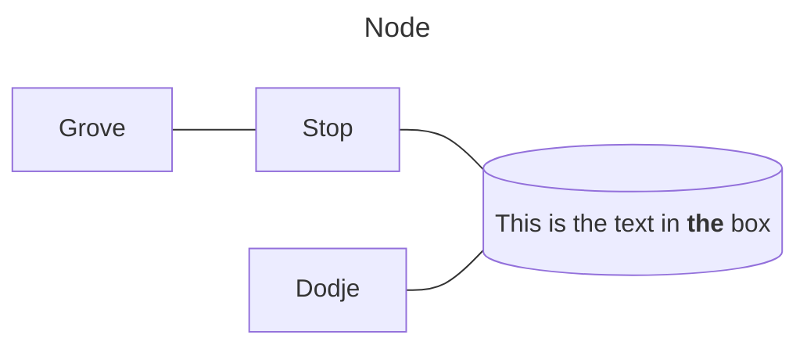

---
date:
  - 09/09/2024 10:16
tags: 
cssclasses:
  - image-borders
  - neutral-pen-black
тип: Заметка
---
# Программа
---
## Начальный уровень
1. Цены, где скачать
	1. [Link](https://obsidian.md/)
	2. [Prices](https://obsidian.md/pricing)
2. Создаем новое хранилище
3. Обзор интерфейса
4. Базовая настройка
5. Внешний вид
6. Базовые плагины
---
**Результат**
- Настроите Obsidianна своем компьютере и познакомитесь с основными функциями программы
---
## Продвинутый уровень
1. Вспоминаем Markdown
2. Ссылки. Обратные ссылки
3. Визуальный граф
4. Добавление картинок и видео
5. Горячие клавиши
6. Резервное копирование
---
**Результат**
- Научитесь оформлять свои заметки с помощью Markdown
- Разберетесь, как связывать заметки между собой
- Как видеть связи между заметками в визуальном режиме.
- Поймете, как структурировать свои заметки
---
## Расширенный уровень
1. Сторонние плагины
2. Многопанельный режим
3. [MermaidJS. Графики и диаграммы](https://mermaid.js.org/syntax/flowchart.html)
4. Создание презентаций
5. Метаданные в заметке
---
**Результат**
- Прокачаете свой Obsidian с помощью плагинов
- Научитесь быстро искать информацию внутри своей базы знаний

