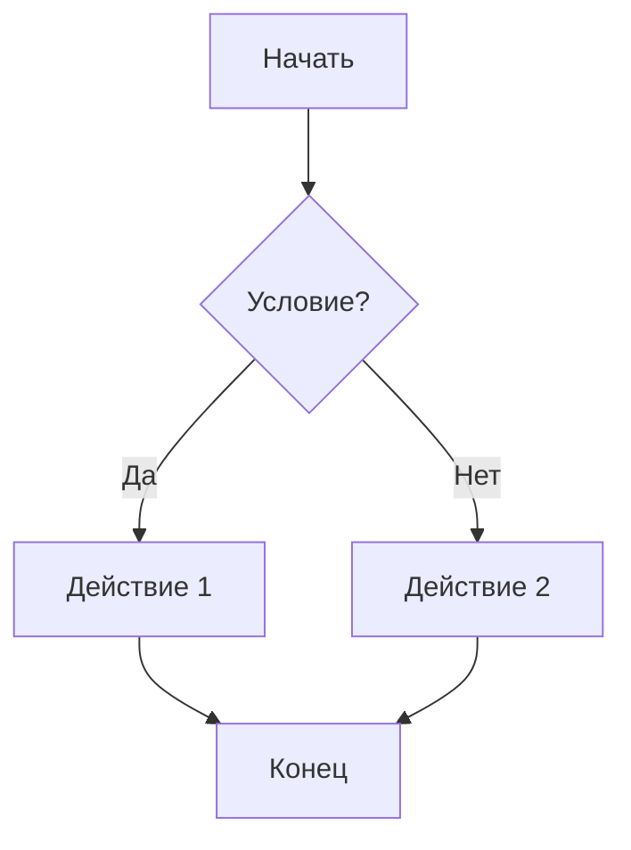

---
date:
  - 12/09/2024 15:07
tags: 
cssclasses:
  - image-borders
  - neutral-pen-black
---
🗂 Материалы с презентации
- Сайт Obsidian (https://obsidian.md/)
- Цены (https://obsidian.md/pricing)
- "Must have" базовые плагины:
1. Command Palette (командная строка)
2. Slash Commands ("/" команды)
3. Quick Switcher (быстрое переключение)
4. Files (просмотр и поиск файлов и папок)
- Справочник по Markdown (на русском) (https://publish.obsidian.md/help-ru/%D0%A0%D1%83%D0%BA%D0%BE%D0%B2%D0%BE%D0%B4%D1%81%D1%82%D0%B2%D0%B0/%D0%A4%D0%BE%D1%80%D0%BC%D0%B0%D1%82%D0%B8%D1%80%D0%BE%D0%B2%D0%B0%D0%BD%D0%B8%D0%B5+%D0%B7%D0%B0%D0%BC%D0%B5%D1%82%D0%BE%D0%BA)
- Автоматическое резервное копирование производится с помощью трех элементов:
1. Git (https://git-scm.com/)
Для установки Git легче всего использовать homebrew. Его можно установить через команду в терминале:
/bin/bash -c "$(curl -fsSL https://raw.githubusercontent.com/Homebrew/install/HEAD/install.sh)"
Далее, после установки, вводим команду brew install git. После этого git будет установлен на вашем устройстве.
Для полного завершения стоит ввести еще две команды:
git config --global user.name "Artem Svyatov" < имя заменить на свое
git config --global user.email example@test.ru < почту заменить на свою
2. Github (http://github.com/)/Gitlab (http://gitlab.com/)
3. Терминал
- Must have сторонних плагинов:
1. Advanced Tables
2. Auto note Mover
3. Better Word Count
4. Calendar
5. Dataview
6. Git
7. Highlightr
8. Linter
9. Ominsearch
10. Paste URL into selection
11. Settings Search
12. Smart Typography
13. Templater
- Пример графа, используя MermaidJS (ссылка на документацию (https://mermaid.js.org/intro/))

- Для создания презентаций в obsidian можно использовать плагин Advanced Slides
- Ссылка на документацию по dataview (https://blacksmithgu.github.io/obsidian-dataview/)
